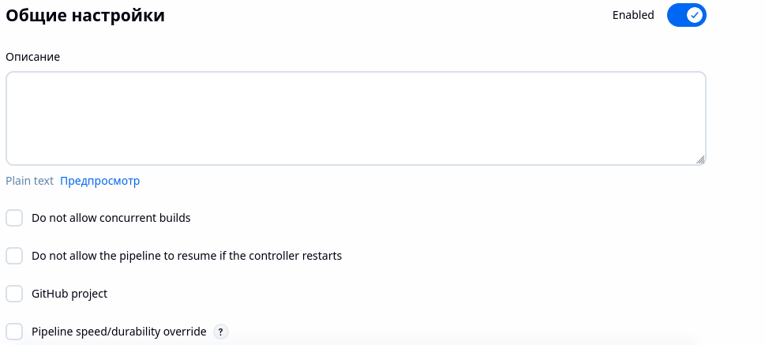
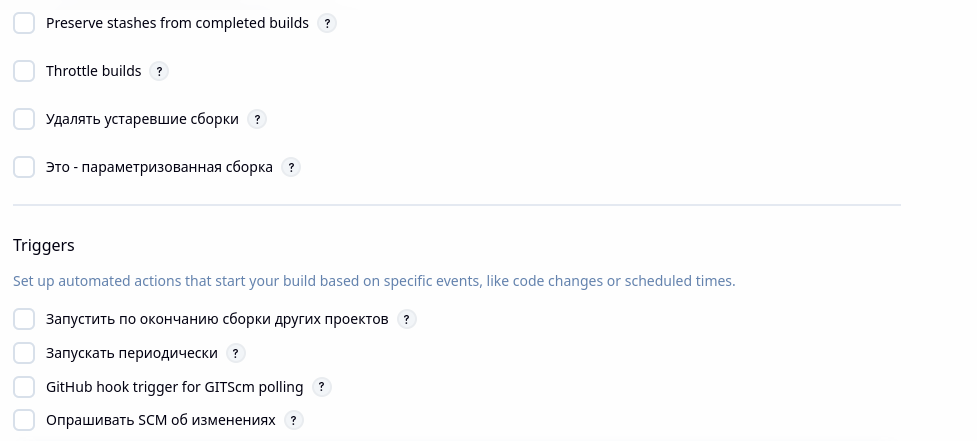
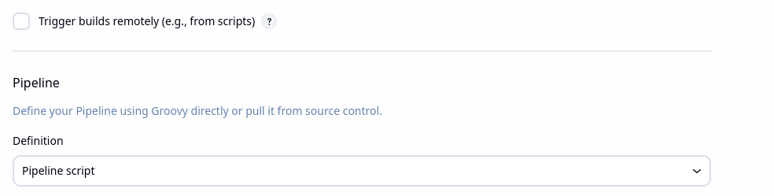
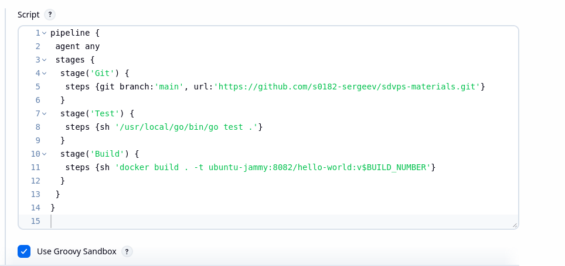
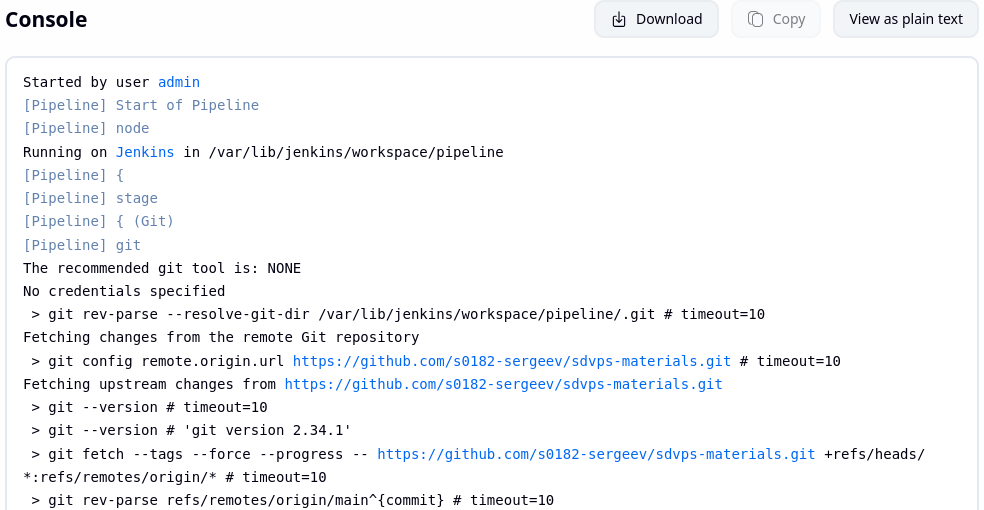
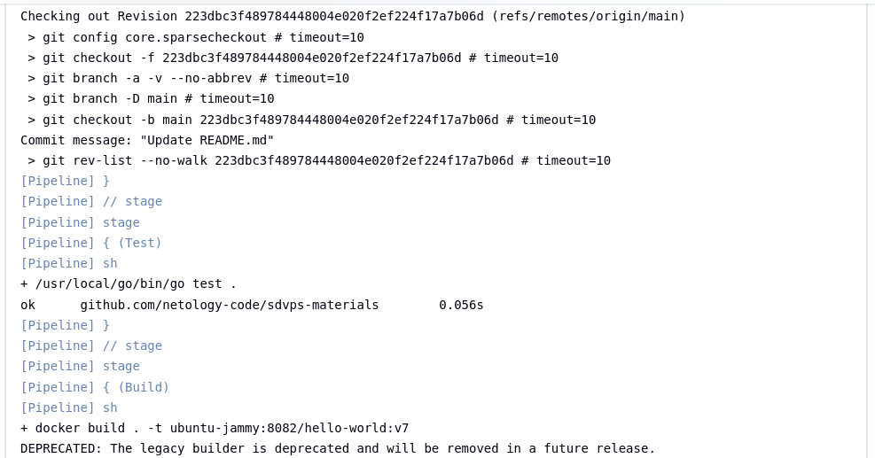
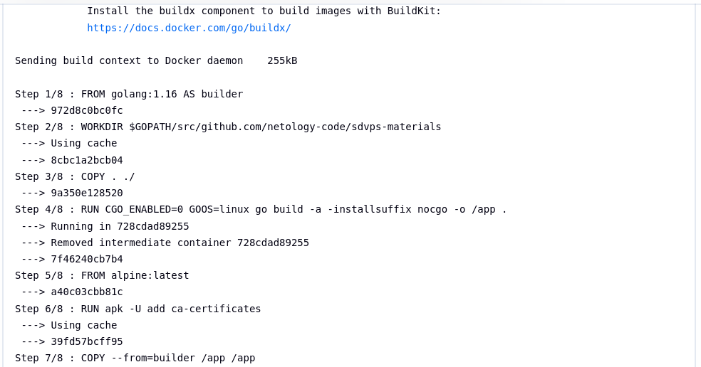
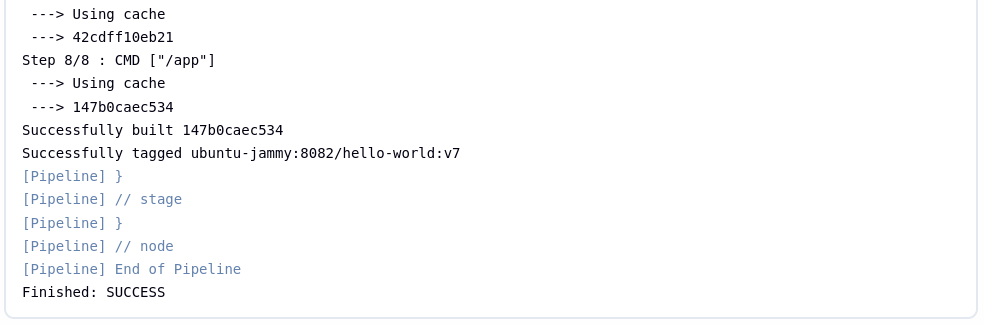
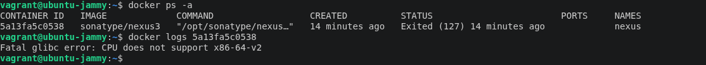
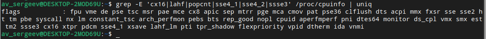

# Домашнее задание к занятию "`Что такое DevOps. СI/СD`" - `Сергеев Александр`


### Инструкция по выполнению домашнего задания

   1. Сделайте `fork` данного репозитория к себе в Github и переименуйте его по названию или номеру занятия, например, https://github.com/имя-вашего-репозитория/git-hw или  https://github.com/имя-вашего-репозитория/7-1-ansible-hw).
   2. Выполните клонирование данного репозитория к себе на ПК с помощью команды `git clone`.
   3. Выполните домашнее задание и заполните у себя локально этот файл README.md:
      - впишите вверху название занятия и вашу фамилию и имя
      - в каждом задании добавьте решение в требуемом виде (текст/код/скриншоты/ссылка)
      - для корректного добавления скриншотов воспользуйтесь [инструкцией "Как вставить скриншот в шаблон с решением](https://github.com/netology-code/sys-pattern-homework/blob/main/screen-instruction.md)
      - при оформлении используйте возможности языка разметки md (коротко об этом можно посмотреть в [инструкции  по MarkDown](https://github.com/netology-code/sys-pattern-homework/blob/main/md-instruction.md))
   4. После завершения работы над домашним заданием сделайте коммит (`git commit -m "comment"`) и отправьте его на Github (`git push origin`);
   5. Для проверки домашнего задания преподавателем в личном кабинете прикрепите и отправьте ссылку на решение в виде md-файла в вашем Github.
   6. Любые вопросы по выполнению заданий спрашивайте в чате учебной группы и/или в разделе “Вопросы по заданию” в личном кабинете.
   
Желаем успехов в выполнении домашнего задания!
   
### Дополнительные материалы, которые могут быть полезны для выполнения задания

1. [Руководство по оформлению Markdown файлов](https://gist.github.com/Jekins/2bf2d0638163f1294637#Code)


---

### Задание 1

Задание выполнял на невиртуализированном Debian 13 с графическим интерфейсом (4Gb памяти).
Установил Vagrant по инструкции https://docs.astra-automation.ru/1.2/misc/tools/vagrant/
Развернул ВМ в VBox из образа Ubuntu 24 из https://vagrant.elab.pro/downloads/
Запустил ВМ и подключился к по ssh:
```
vagrant up
vagrant ssh
```

1. Действовал по инструкции https://www.jenkins.io/doc/book/installing/linux/.
Проверил наличие java:
```
java -version
dpkg -l | grep openjdk
```

Установил Oracle java 21 jdk (соответствует openjava 21 jdk), который содержит jre. На сайте производителя Java https://www.oracle.com/java/technologies/downloads/?roistat_visit=9957740#java21 скопировал ссылку на установочный файл, загрузил его и установил Java 21 jdk:
```
wget https://download.oracle.com/java/21/latest/jdk-21_linux-x64_bin.deb
sudo dpkg -i jdk-21_linux-x64_bin.deb
java -version
```

Установил jenkins (установщик задает автозапуск сервиса):
```
sudo wget -O /etc/apt/keyrings/jenkins-keyring.asc \
  https://pkg.jenkins.io/debian-stable/jenkins.io-2026.key
echo "deb [signed-by=/etc/apt/keyrings/jenkins-keyring.asc]" \
  https://pkg.jenkins.io/debian-stable binary/ | sudo tee \
  /etc/apt/sources.list.d/jenkins.list > /dev/null
sudo apt update
sudo apt install jenkins
```

В браузере на хостовой ОС ввел адрес jenkins http://192.168.56.10:8080
Установил пароль админа jenkins (взял временный пароль из файла).
Выбрал установку обычных плагинов, ввел реквизиты администратора.
```
sudo cat /var/lib/jenkins/secrets/initialAdminPassword
```

2. Go не устанавливал, потому что он установлен в docker.

3. В браузере на хостовой ОС открыл в браузере страницу репозитория https://github.com/netology-code/sdvps-materials.git и сделал fork в свой репозиторий - получился https://github.com/s0182-sergeev/sdvps-materials.git.

4. В браузере на хостовой ОС открыл jenkins http://192.168.56.10:8080 и зарегистрировался как admin. Создал в jenkins проект типа Freestyle Project (задача со свободной конфигурацией) с именем my_pipe. ввел адрес своего репозитория и указал его ветку main, триггер не выбирал, в разделе Build Steps (Шаги сборки) добавил шаг «Execute shell (Выполнить команду shell)», ввел текст команды из дополнительных материалов к домашнему заданию:
```
/usr/local/go/bin/go test .
docker build . -t ubuntu-jammy:8082/hello-world:v$BUILD_NUMBER
```

Включил пользователя jenkins и себя (vagrant) в группу docker. Для принятия изменений переподключился в ssh, рестартовал сервис jenkins (sudo systemctl restart jenkins.service) и обновил страницу jenkins в браузере.
```
sudo usermod -aG docker jenkins
sudo usermod -aG docker $USER
id jenkins
```

Скриншоты с настройками проекта и результатами выполнения сборки:


---

### Задание 2

1. Создал в веб-интерфейсе jenkins новую задачу типа «pipeline» с именем pipeline.
2. В веб-интерфейсе jenkins скопировал код декларативного описания pipeline из дополнительного материала и корректировал под свое окружение. Запустил проект на выполнение.
```
pipeline {
 agent any
 stages {
  stage('Git') {
   steps {git branch:'main', url:'https://github.com/s0182-sergeev/sdvps-materials.git'}
  }
  stage('Test') {
   steps {sh '/usr/local/go/bin/go test .'}
  }
  stage('Build') {
   steps {sh 'docker build . -t ubuntu-jammy:8082/hello-world:v$BUILD_NUMBER'}
  }
 }
}
```

Cкриншоты с настройками проекта и результатами выполнения сборки:










---

### Задание 3

Задание 3 не выполнил, потому что оказалось недостаточно оперативной памяти на хостовой ОС (4Gb).

1. Образ docker с Nexus был установлен Vagrant на ВМ:
```
docker images
docker ps -a
```

Запустил nexus в контейнере docker:
```
docker run -d -p 192.168.56.10:8081:8081 -p 192.168.56.10:8082:8082 --name nexus -e INSTALL4J_ADD_VM_PARAMS="-Xms512m -Xmx512m -XX:MaxDirectMemorySize=273m" sonatype/nexus3
```

Контейнер не стартовал, потому что процессор моего ноутбука не поддерживает код Nexus (latest version=3.77.0), ошибка «Fatal glibc error: CPU does not support x86-64-v2». Удалил контейнер:
```
docker ps -a
docker logs 5a13fa5c0538
docker rm 5a13fa5c0538
```


Выяснил, что Sonatype Nexus Repository требует поддержки инструкций процессора x86-64-v2, начиная с версии 3.61.0 и выше, так как эти версии перешли на использование более новой версии JRE (Java Runtime Environment) и библиотек. Для корректной работы необходимо, чтобы процессор поддерживал SSE4.2, SSSE3, POPCNT и CMPXCHG16B.
Проверил, что мой процессор не поддерживает:
```
grep -E 'cx16|lahf|popcnt|sse4_1|sse4_2|ssse3' /proc/cpuinfo | uniq
```


Установил образ nexus версии 3.60.0:
```
docker pull pierrelouistalbot/nexus:3.60.0
```

Запустил nexus версии 3.60.0 в контейнере docker:
```
docker run -d -p 192.168.56.10:8081:8081 -p 192.168.56.10:8082:8082 --name nexus -e INSTALL4J_ADD_VM_PARAMS="-Xms512m -Xmx512m -XX:MaxDirectMemorySize=273m" pierrelouistalbot/nexus:3.60.0
```

Эта команда остановила ВМ (вероятно, nexus не хватает памяти, хотя в логе об этом ни слова), удалил контейнер:
```
docker ps -a
docker logs nexus
docker rm 99b2e0704f09
```
